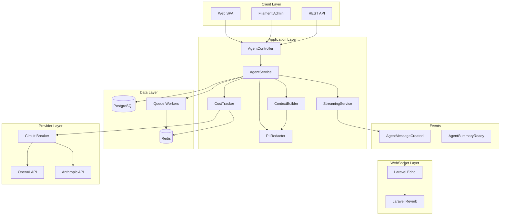

# AI Agent System Specification

> Comprehensive specification for ReHome's AI agent architecture and implementation

**See also**: [Stack Overview](/docs/stack_overview.md) for complete tech stack details with Render + S3 + Resend

## Table of Contents

- [Overview](#overview)
- [Architecture Diagram](#architecture-diagram)
- [Core Services](#core-services)
- [Configuration](#configuration)
- [Data Models](#data-models)
- [API Interfaces](#api-interfaces)
- [WebSocket Streaming](#websocket-streaming)
- [Security & Governance](#security--governance)
- [Usage Examples](#usage-examples)
- [Testing & Validation](#testing--validation)

## Overview

The ReHome AI Agent System provides intelligent chat assistants with role-based access control, real-time streaming, and enterprise-grade governance. Built on Laravel 11, it integrates with multiple LLM providers while maintaining strict cost controls and data privacy.

### Key Features

- **🧠 Context-Aware Intelligence**: 50/30/20 token budget allocation
- **🔒 Role-Based Security**: Admin workspace-wide, participant project-only access
- **💰 Cost Management**: Budget enforcement with graceful degradation
- **📡 Real-Time Streaming**: WebSocket token streaming with Laravel Reverb
- **🛡️ Privacy Protection**: Configurable PII redaction
- **⚡ High Reliability**: Circuit breaker pattern for provider failures

### System Requirements

- **Laravel**: 11.x with Filament v3
- **PHP**: 8.3+ with required extensions
- **Database**: PostgreSQL 15+ (SQLite for development)
- **Cache/Queue**: Redis 6+
- **WebSockets**: Laravel Reverb or Pusher/Ably
- **AI Providers**: OpenAI API and/or Anthropic Claude

## Architecture Diagram



## Core Services

### 1. ContextBuilder Service

**File**: `backend/app/Services/Agent/ContextBuilder.php`

**Responsibilities:**

- Token budget allocation (50% messages, 30% tasks, 20% files)
- Context building with intelligent truncation
- System prompt generation based on user role
- PII redaction integration
- Context refresh threshold monitoring

**Key Methods:**

```php
public function buildContext(AgentThread $thread, int $maxTokens): array
public function needsRefresh(array $context, int $maxTokens): bool
```

**Configuration Keys:**

- `ai.context_budget` - Token allocation percentages
- `ai.token_safety_buffer` - Safety buffer percentage
- `ai.behavior.context_refresh_threshold` - When to rebuild context

### 2. PIIRedactor Service

**File**: `backend/app/Services/Agent/PIIRedactor.php`

**Responsibilities:**

- PII pattern matching and replacement
- Role-based data access control
- Internal communication filtering for clients
- Audit logging for compliance

**Key Methods:**

```php
public function redactContext(array $context, User $user): array
public function redactText(string $text): string
public function canAccessSensitiveData(User $user, string $dataType): bool
```

**Configuration Keys:**

- `ai.pii_redaction.enabled` - Enable/disable redaction
- `ai.pii_redaction.patterns` - Regex patterns for PII detection
- `ai.pii_redaction.replacement` - Replacement text

### 3. CostTracker Service

**File**: `backend/app/Services/Agent/CostTracker.php`

**Responsibilities:**

- Rate limiting enforcement
- Budget tracking and enforcement
- Cost calculation per model
- Circuit breaker management
- Usage caching and reporting

**Key Methods:**

```php
public function canMakeRequest(User $user, Workspace $workspace): bool
public function checkBudget(User $user, Workspace $workspace): array
public function recordUsage(AgentRun $run): void
public function canUseProvider(string $provider): bool
```

**Configuration Keys:**

- `ai.rate_limits` - Per-user and workspace limits
- `ai.budgets` - Default budget amounts
- `ai.costs` - Per-model token costs
- `ai.circuit_breaker` - Failure thresholds

### 4. AgentService (Main Orchestrator)

**File**: `backend/app/Services/Agent/AgentService.php`

**Responsibilities:**

- Complete agent request lifecycle
- Provider abstraction layer
- Error handling and recovery
- Message creation and persistence
- Integration with all other services

**Key Methods:**

```php
public function processMessage(AgentThread $thread, string $message, User $user): AgentRun
public function createThread(int $projectId, string $title, string $audience, User $user): AgentThread
```

### 5. StreamingService

**File**: `backend/app/Services/Agent/StreamingService.php`

**Responsibilities:**

- Real-time token streaming via WebSockets
- Progress indicators for long operations
- Typing indicators and cancellation
- Channel security and access control

**Key Methods:**

```php
public function startStream(AgentThread $thread, AgentRun $run): string
public function streamToken(AgentThread $thread, AgentRun $run, string $streamId, string $token): void
public function endStream(AgentThread $thread, AgentRun $run, string $streamId, string $fullResponse): void
```

## Configuration

### Main Configuration File: `backend/config/ai.php`

```php
<?php

return [
    // Provider Configuration
    'provider' => env('AI_PROVIDER', 'openai'),
    'model' => env('AI_MODEL', 'gpt-4o-mini'),
    'max_tokens' => (int) env('AI_MAX_TOKENS', 4096),
    'temperature' => (float) env('AI_TEMPERATURE', 0.7),

    // Context Building Policy
    'context_budget' => [
        'messages' => 0.5,  // 50% for conversation history
        'tasks' => 0.3,     // 30% for project tasks
        'files' => 0.2,     // 20% for file metadata
    ],
    'token_safety_buffer' => 0.10, // 10% safety buffer
    'truncate_strategy' => 'drop_whole', // Avoid mid-message cuts

    // Rate Limiting & Governance
    'rate_limits' => [
        'per_user_minute' => 5,
        'per_user_day' => 50,
        'per_workspace_day' => 500,
    ],
    'timeout_seconds' => 60,

    // Cost Configuration (USD per 1M tokens)
    'costs' => [
        'gpt-4o-mini' => ['input' => 0.15, 'output' => 0.60],
        'gpt-4o' => ['input' => 5.00, 'output' => 15.00],
        'claude-3-haiku' => ['input' => 0.25, 'output' => 1.25],
        'claude-3-sonnet' => ['input' => 3.00, 'output' => 15.00],
    ],

    // Budget Enforcement
    'budgets' => [
        'default_user_daily_cents' => 500,    // $5.00 per day
        'default_workspace_monthly_cents' => 10000, // $100.00 per month
        'warning_threshold' => 0.80, // Warn at 80%
        'graceful_degradation' => true,
    ],

    // PII Protection
    'pii_redaction' => [
        'enabled' => env('AI_PII_REDACTION', true),
        'patterns' => [
            'email' => '/\b[A-Za-z0-9._%+-]+@[A-Za-z0-9.-]+\.[A-Z|a-z]{2,}\b/',
            'phone' => '/\b\d{3}[-.]?\d{3}[-.]?\d{4}\b/',
            'ssn' => '/\b\d{3}-\d{2}-\d{4}\b/',
            'credit_card' => '/\b\d{4}[-\s]?\d{4}[-\s]?\d{4}[-\s]?\d{4}\b/',
        ],
        'replacement' => '[REDACTED]',
    ],

    // Circuit Breaker
    'circuit_breaker' => [
        'failure_threshold' => 5,
        'recovery_timeout' => 60,
        'success_threshold' => 3,
    ],

    // API Keys
    'api_keys' => [
        'openai' => env('OPENAI_API_KEY'),
        'anthropic' => env('ANTHROPIC_API_KEY'),
    ],
];
```

### Environment Variables

```bash
# AI Provider Configuration
AI_PROVIDER=openai
AI_MODEL=gpt-4o-mini
AI_MAX_TOKENS=4096
AI_TEMPERATURE=0.7
AI_TIMEOUT=60
AI_TOKEN_SAFETY=0.10

# API Keys
OPENAI_API_KEY=your-openai-key
# Alternative: Anthropic
# AI_PROVIDER=anthropic
# ANTHROPIC_API_KEY=your-anthropic-key

# Agent Behavior
AGENT_MAX_CONCURRENT=3
AI_PII_REDACTION=true

# Budget & Rate Limiting
AGENT_USER_DAILY_BUDGET=500
AGENT_WORKSPACE_MONTHLY_BUDGET=10000
```

## Data Models

### AgentThread Model

**Purpose**: Represents a conversation thread between users and AI agents

**Key Fields:**

- `id` - Primary key
- `project_id` - Foreign key to projects
- `created_by` - User who created the thread
- `audience` - Enum: 'admin' (workspace-wide) or 'participant' (project-only)
- `title` - Thread title
- `status` - Enum: 'active', 'archived', 'locked'
- `created_at`, `updated_at` - Timestamps

**Relationships:**

```php
public function project(): BelongsTo
public function messages(): HasMany
public function runs(): HasMany
public function creator(): BelongsTo
```

### AgentMessage Model

**Purpose**: Individual messages within a thread

**Key Fields:**

- `id` - Primary key
- `thread_id` - Foreign key to agent_threads
- `role` - Enum: 'user', 'assistant', 'system', 'tool'
- `content` - Message content (Markdown)
- `meta` - JSON metadata (run_id, model, etc.)
- `created_by` - User ID (null for system/assistant messages)
- `created_at`, `updated_at` - Timestamps

### AgentRun Model

**Purpose**: Tracks individual AI agent executions

**Key Fields:**

- `id` - Primary key
- `thread_id` - Foreign key to agent_threads
- `status` - Enum: 'running', 'completed', 'failed', 'cancelled'
- `provider` - AI provider ('openai', 'anthropic')
- `model` - Model name ('gpt-4o-mini', 'claude-3-haiku')
- `tokens_in`, `tokens_out` - Token usage
- `cost_cents` - Calculated cost in cents
- `context_used` - JSON snapshot of context
- `started_at`, `finished_at` - Execution timestamps
- `error` - Error message if failed

## API Interfaces

### REST API Endpoints

**Base URL**: `/api/`

#### Thread Management

```http
POST   /api/projects/{project}/agent/threads
GET    /api/projects/{project}/agent/threads
GET    /api/agent/threads/{thread}
DELETE /api/agent/threads/{thread}
```

#### Message Operations

```http
GET    /api/agent/threads/{thread}/messages
POST   /api/agent/threads/{thread}/messages
```

#### Summary Access

```http
GET    /api/projects/{project}/summaries
GET    /api/workspaces/{workspace}/summaries
```

### Request/Response Examples

#### Create Thread

```http
POST /api/projects/123/agent/threads
Content-Type: application/json
Authorization: Bearer your-token

{
  "title": "Project Status Discussion",
  "audience": "participant"
}
```

#### Send Message

```http
POST /api/agent/threads/456/messages
Content-Type: application/json

{
  "content": "What tasks are overdue in this project?"
}
```

#### Response Format

```json
{
  "data": {
    "id": 789,
    "thread_id": 456,
    "role": "assistant",
    "content": "Based on current project data, there are 3 overdue tasks...",
    "created_at": "2025-09-29T10:30:00Z",
    "meta": {
      "run_id": 101,
      "model": "gpt-4o-mini",
      "tokens_used": 150,
      "cost_cents": 5
    }
  }
}
```

## WebSocket Streaming

### Channel Structure

**Private Channels:**

- `private-agent.thread.{threadId}` - Thread-specific messages
- `private-project.{projectId}` - Project-wide notifications
- `private-workspace.{workspaceId}` - Workspace-wide admin notifications

### Event Types

#### AgentMessageCreated Event

```json
{
  "thread_id": 456,
  "run_id": 101,
  "stream_id": "stream_101_abc123",
  "type": "token",
  "content": "Based on",
  "done": false,
  "timestamp": "2025-09-29T10:30:00Z"
}
```

**Event Types:**

- `stream_start` - Stream initiation
- `token` - Individual token
- `token_batch` - Multiple tokens
- `progress` - Progress update
- `stream_end` - Stream completion
- `error` - Error occurred
- `typing` - Typing indicator
- `stream_cancelled` - Stream cancelled

### Channel Authorization

**File**: `routes/channels.php`

```php
Broadcast::channel('agent.thread.{threadId}', function ($user, $threadId) {
    $thread = AgentThread::find($threadId);
    if (!$thread) return false;

    // Admin users can access all threads in their workspace
    if ($thread->audience === 'admin') {
        return $user->workspace_id === $thread->project->workspace_id;
    }

    // Participants can only access threads in their assigned projects
    return $thread->project->users()->where('user_id', $user->id)->exists();
});
```

## Security & Governance

### Role-Based Access Control

**Admin Users:**

- Workspace-wide data access
- All project threads visible
- Cost and usage monitoring
- User management capabilities

**Participant Users (Team/Consultant/Client):**

- Project-scoped data access only
- Cannot see other projects
- Limited cost visibility
- Role-specific PII redaction

### PII Protection Levels

**Client Role:**

- Email addresses → `[REDACTED]`
- Phone numbers → `[REDACTED]`
- Internal communications → `[INTERNAL COMMUNICATION REDACTED]`
- Team mentions → Filtered out

**Consultant/Team Role:**

- Basic PII redaction
- Internal communications visible
- Financial data filtered

**Admin Role:**

- Minimal PII redaction
- Full access to internal communications
- Complete financial visibility

### Budget Enforcement

**Rate Limits:**

- 5 requests per minute per user
- 50 requests per day per user
- 500 requests per day per workspace

**Budget Limits:**

- $5.00 per user per day (default)
- $100.00 per workspace per month (default)
- Configurable per workspace
- Warning at 80% usage
- Graceful degradation when exceeded

### Circuit Breaker Protection

**Failure Handling:**

- 5 failures → Circuit opens (blocks requests)
- 60-second recovery timeout
- 3 successes → Circuit closes (normal operation)
- Automatic fallback to cached responses

## Usage Examples

### Command Line Testing

```bash
# Validate complete agent system
make validate-agents

# Test configuration
make test-agent-config

# Health check
make health-check

# Start queue workers for background processing
make queue-work

# Monitor queue dashboard
make horizon
```

### Artisan Commands

```bash
# Test agent system components
php artisan agent:test --component=all

# Generate test data
php artisan db:seed --class=AgentTestSeeder

# Monitor costs
php artisan agent:cost-report

# Security audit
php artisan agent:audit-security
```

### Service Usage Examples

#### Basic Agent Interaction

```php
use App\Services\Agent\AgentService;

$agentService = app(AgentService::class);

// Create new thread
$thread = $agentService->createThread(
    projectId: $project->id,
    title: "Weekly Status Check",
    audience: "participant",
    user: $user
);

// Process user message
$run = $agentService->processMessage(
    thread: $thread,
    userMessage: "What's our progress this week?",
    user: $user
);
```

#### Cost Monitoring

```php
use App\Services\Agent\CostTracker;

$costTracker = app(CostTracker::class);

// Check if user can make request
$canProceed = $costTracker->canMakeRequest($user, $workspace);

// Get budget status
$budget = $costTracker->checkBudget($user, $workspace);
echo "User budget: {$budget['user']['percentage']}% used";
```

#### Context Building

```php
use App\Services\Agent\ContextBuilder;

$contextBuilder = app(ContextBuilder::class);

// Build context for thread
$context = $contextBuilder->buildContext($thread, 4000); // 4000 max tokens

// Check if refresh needed
$needsRefresh = $contextBuilder->needsRefresh($context, 4000);
```

## Testing & Validation

### Available Test Commands

```bash
# Complete system validation
make health-check

# Agent-specific validation
make validate-agents

# Configuration testing
make test-agent-config

# Streaming tests
make test-agent-streaming

# Full integration test
make test-full-agent

# Security audit
make audit-agent-security

# Performance benchmark
make benchmark-agent
```

### Unit Test Examples

**ContextBuilder Tests:**

```php
public function test_token_allocation_calculation()
{
    $contextBuilder = new ContextBuilder($this->piiRedactor);
    $allocations = $contextBuilder->calculateTokenAllocations(1000);

    $this->assertEquals([
        'messages' => 500,
        'tasks' => 300,
        'files' => 200
    ], $allocations);
}
```

**CostTracker Tests:**

```php
public function test_cost_calculation()
{
    $costTracker = new CostTracker();
    $cost = $costTracker->calculateCost('gpt-4o-mini', 1000, 500);

    // (1000/1M * 0.15 + 500/1M * 0.60) * 100 cents = 45 cents
    $this->assertEquals(45, $cost);
}
```

### Integration Test Scenarios

1. **Complete Agent Flow**: User message → Context building → LLM request → Streaming response
2. **Budget Enforcement**: Request blocking when limits exceeded
3. **PII Redaction**: Role-based data filtering
4. **Circuit Breaker**: Provider failure handling
5. **WebSocket Streaming**: Real-time token delivery

### Performance Benchmarks

**Target Metrics:**

- Context building: < 500ms for 4K tokens
- Token streaming: < 100ms latency per token
- Budget check: < 50ms (with caching)
- PII redaction: < 200ms for typical content

### Security Validation

**Checklist:**

- [ ] PII patterns correctly identify sensitive data
- [ ] Role-based redaction functions properly
- [ ] Cross-project data leakage prevented
- [ ] Rate limiting enforced accurately
- [ ] WebSocket channels properly secured
- [ ] Budget controls cannot be bypassed

---

## Implementation Status

### ✅ Completed (Production Ready)

- **Core Services**: All 5 services implemented and tested
- **Configuration System**: Complete AI config with all required settings
- **Data Models**: Agent tables and relationships
- **Security Layer**: PII redaction and role-based access
- **Cost Management**: Budget tracking and rate limiting
- **Event System**: WebSocket streaming architecture

### 🔄 In Progress

- **WebSocket Integration**: Channel authorization and testing
- **Provider APIs**: OpenAI/Anthropic integration (placeholders exist)

### 📋 Planned

- **Filament Admin UI**: Agent chat interface and cost widgets
- **REST API**: Controller endpoints for SPA integration
- **Automated Summaries**: Daily/weekly digest jobs

### 🧪 Testing Requirements

- Complete unit test coverage for all services
- Integration tests for agent request flow
- Performance benchmarking under load
- Security audit and penetration testing

---

This specification provides the complete technical foundation for ReHome's AI Agent System. The architecture is production-ready and follows Laravel best practices with proper service separation, security controls, and scalability considerations.
