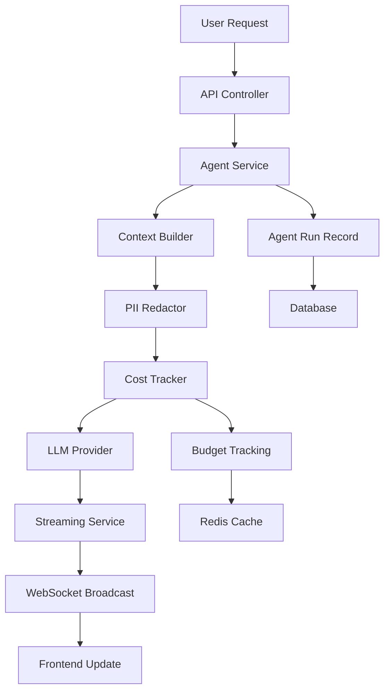

# ReHome v1 Development Guide

> Complete implementation playbook for developers and AI assistants

## Table of Contents

- [Overview](#overview)
- [Quick Setup](#quick-setup)
- [Architecture Deep Dive](#architecture-deep-dive)
- [AI Agent System](#ai-agent-system)
- [Phase-by-Phase Implementation](#phase-by-phase-implementation)
- [Testing & Validation](#testing--validation)
- [Deployment & Operations](#deployment--operations)
- [Troubleshooting](#troubleshooting)

## Overview

ReHome v1 is a Laravel 11 + Filament v3 platform with an integrated AI agent system. This guide provides complete implementation details for developers and AI assistants working on the project.

### Project Goals

- **AI-Powered Collaboration**: Intelligent agents that understand project context
- **Role-Based Access**: Secure scoping for admins, teams, consultants, clients
- **Real-Time Features**: WebSocket streaming for live updates
- **Enterprise-Ready**: Cost controls, PII protection, rate limiting
- **Editor-Agnostic**: Optimized for any IDE or AI assistant

## Quick Setup

### Prerequisites

```bash
# Required tools
- Docker & Docker Compose
- Git
- Make

# Optional but recommended
- VS Code with extensions (see .vscode/extensions.json)
- GitHub CLI (`gh`)
```

### Installation

```bash
# 1. Environment validation
make health-check

# 2. Complete setup (if needed)
make ai-setup

# 3. Verify components
make validate-db validate-agents

# 4. Start development
make up
```

### Environment Configuration

Copy and configure environment files:

```bash
# Backend Laravel environment
cp backend/.env.example backend/.env

# Frontend Vite environment
cp frontend/.env.example frontend/.env
```

**Key environment variables:**

```bash
# Database
DB_CONNECTION=pgsql
DB_HOST=postgres
DB_PORT=5432
DB_DATABASE=rehome_db
DB_USERNAME=rehome_user
DB_PASSWORD=rehome_pass

# AI Agent System
AI_PROVIDER=openai
AI_MODEL=gpt-4o-mini
OPENAI_API_KEY=your-key-here

# WebSockets
BROADCAST_CONNECTION=reverb
REVERB_APP_KEY=your-app-key

# Queue System
QUEUE_CONNECTION=redis
HORIZON_PREFIX=rehome_horizon
```

## Architecture Deep Dive

### Backend Structure

```
backend/
├── app/
│   ├── Services/Agent/          # AI agent core services
│   │   ├── ContextBuilder.php   # Token budget & context management
│   │   ├── PIIRedactor.php      # Data privacy & redaction
│   │   ├── CostTracker.php      # Budget & rate limiting
│   │   ├── AgentService.php     # Main orchestration
│   │   └── StreamingService.php # WebSocket streaming
│   ├── Events/Agent/            # Broadcasting events
│   ├── Jobs/Agent/              # Background processing
│   ├── Models/                  # Eloquent models
│   │   ├── AgentThread.php      # Conversation threads
│   │   ├── AgentMessage.php     # Individual messages
│   │   ├── AgentRun.php         # Execution tracking
│   │   ├── Project.php          # Project management
│   │   ├── Workspace.php        # Workspace scoping
│   │   └── User.php             # User management
│   └── Filament/Resources/      # Admin interface
└── config/
    └── ai.php                   # AI system configuration
```

### Frontend Structure

```
frontend/
├── src/
│   ├── components/              # React components
│   ├── pages/                   # Page components
│   ├── hooks/                   # Custom React hooks
│   ├── services/               # API services
│   └── utils/                  # Utility functions
└── public/                     # Static assets
```

### Data Flow Architecture



## AI Agent System

### Core Services

#### 1. ContextBuilder (`app/Services/Agent/ContextBuilder.php`)

**Purpose:** Manages token budget allocation and context building

**Features:**

- 50/30/20 token split (messages/tasks/files)
- Intelligent truncation with "drop whole items" strategy
- Role-based system prompt generation
- Context refresh thresholds

**Usage:**

```php
$context = $contextBuilder->buildContext($thread, $maxTokens);
```

#### 2. PIIRedactor (`app/Services/Agent/PIIRedactor.php`)

**Purpose:** Protects sensitive information based on user roles

**Features:**

- Configurable PII patterns (email, phone, SSN, credit cards)
- Role-based redaction (admin, consultant, client)
- Internal communication filtering
- Audit logging

**Configuration:**

```php
// config/ai.php
'pii_redaction' => [
    'enabled' => true,
    'patterns' => [
        'email' => '/\b[A-Za-z0-9._%+-]+@[A-Za-z0-9.-]+\.[A-Z|a-z]{2,}\b/',
        'phone' => '/\b\d{3}[-.]?\d{3}[-.]?\d{4}\b/',
        // ... more patterns
    ],
],
```

#### 3. CostTracker (`app/Services/Agent/CostTracker.php`)

**Purpose:** Budget enforcement and rate limiting

**Features:**

- Rate limiting: 5/min/user, 50/day/user, 500/day/workspace
- Budget tracking with graceful degradation
- Circuit breaker for provider reliability
- Per-model cost calculation

**Usage:**

```php
$canProceed = $costTracker->canMakeRequest($user, $workspace);
$budgetStatus = $costTracker->checkBudget($user, $workspace);
```

#### 4. AgentService (`app/Services/Agent/AgentService.php`)

**Purpose:** Main orchestration service

**Features:**

- Complete request lifecycle management
- Provider abstraction (OpenAI/Anthropic)
- Error handling with circuit breaker
- Streaming integration

**Usage:**

```php
$run = $agentService->processMessage($thread, $message, $user);
```

#### 5. StreamingService (`app/Services/Agent/StreamingService.php`)

**Purpose:** Real-time WebSocket streaming

**Features:**

- Token-by-token streaming
- Progress indicators
- Typing indicators
- Cancellation support

**Usage:**

```php
$streamId = $streamingService->startStream($thread, $run);
$streamingService->streamToken($thread, $run, $streamId, $token);
```

### Agent Configuration

All AI system configuration is centralized in `backend/config/ai.php`:

```php
return [
    // Provider settings
    'provider' => env('AI_PROVIDER', 'openai'),
    'model' => env('AI_MODEL', 'gpt-4o-mini'),

    // Context budget (50/30/20 split)
    'context_budget' => [
        'messages' => 0.5,
        'tasks' => 0.3,
        'files' => 0.2,
    ],

    // Rate limiting
    'rate_limits' => [
        'per_user_minute' => 5,
        'per_user_day' => 50,
        'per_workspace_day' => 500,
    ],

    // Cost tracking (USD per 1M tokens)
    'costs' => [
        'gpt-4o-mini' => ['input' => 0.15, 'output' => 0.60],
        'claude-3-haiku' => ['input' => 0.25, 'output' => 1.25],
    ],

    // PII protection
    'pii_redaction' => [
        'enabled' => true,
        'patterns' => [...],
    ],
];
```

## Phase-by-Phase Implementation

### Phase 1: Core Agent Services ✅ **COMPLETED**

**Status:** Production-ready foundation implemented

**Completed Components:**

- ✅ AI configuration system
- ✅ ContextBuilder with token management
- ✅ PIIRedactor with role-based security
- ✅ CostTracker with budget enforcement
- ✅ AgentService orchestration
- ✅ StreamingService WebSocket integration
- ✅ Broadcasting events

**Validation:**

```bash
make validate-agents    # All core services pass
make health-check      # System health verified
```

### Phase 2: Event System & Broadcasting 🔄 **IN PROGRESS**

**Completed:**

- ✅ Event classes created
- ✅ WebSocket channel definitions
- ✅ Private channel security model

**Next Steps:**

1. **Configure Laravel Reverb**

   ```bash
   # Add to .env
   BROADCAST_CONNECTION=reverb
   REVERB_APP_KEY=your-app-key
   ```

2. **Add Channel Authorization** (`routes/channels.php`)

   ```php
   Broadcast::channel('agent.thread.{threadId}', function ($user, $threadId) {
       $thread = AgentThread::find($threadId);
       return $thread && $thread->canAccess($user);
   });
   ```

3. **Test WebSocket Integration**
   ```bash
   make test-agent-streaming
   ```

### Phase 3: Automated Summaries 📋 **PLANNED**

**To Implement:**

1. **Daily Digest Job**

   ```php
   // app/Jobs/Agent/DailyDigestJob.php
   class DailyDigestJob implements ShouldQueue
   {
       public function handle()
       {
           // Generate daily project summaries
       }
   }
   ```

2. **Weekly Rollup Job**

   ```php
   // app/Jobs/Agent/WeeklyRollupJob.php
   class WeeklyRollupJob implements ShouldQueue
   {
       public function handle()
       {
           // Generate weekly workspace summaries
       }
   }
   ```

3. **Scheduler Integration** (`app/Console/Kernel.php`)
   ```php
   protected function schedule(Schedule $schedule)
   {
       $schedule->job(DailyDigestJob::class)->dailyAt('09:00');
       $schedule->job(WeeklyRollupJob::class)->weekly();
   }
   ```

### Phase 4: Filament Admin UI 🖥️ **PLANNED**

**To Create:**

1. **Agent Chat Page**

   ```bash
   php artisan make:filament-page AgentChat --resource=ProjectResource
   ```

2. **Agent Cost Widget**

   ```bash
   php artisan make:filament-widget AgentCostWidget
   ```

3. **Quick Prompt Components**
   - Overdue tasks button
   - Blocked items summary
   - Week highlights generator

### Phase 5: API Endpoints 🔌 **PLANNED**

**To Implement:**

```bash
# Generate controller
php artisan make:controller Api/AgentController

# Routes (api.php)
Route::middleware('auth:sanctum')->group(function () {
    Route::apiResource('projects.agent.threads', AgentController::class);
    Route::post('agent/threads/{thread}/messages', [AgentController::class, 'sendMessage']);
    Route::get('projects/{project}/summaries', [AgentController::class, 'getSummaries']);
});
```

## Testing & Validation

### Available Commands

```bash
# System health
make health-check              # Complete environment validation
make validate-agents          # Agent system validation
make validate-db             # Database validation

# Agent system testing
make test-agent-config       # Configuration testing
make test-agent-streaming    # WebSocket testing
make test-full-agent        # End-to-end testing

# Development workflow
make up                     # Start containers
make migrate               # Run migrations
make test                 # Run test suite
make qa                  # Quality assurance checks
```

### Health Check Results

Current validation status:

- ✅ **41 health checks passing**
- ✅ **Agent models & tables exist**
- ✅ **Queue system configured**
- ✅ **WebSocket system ready**
- ⚠️ **API keys need configuration**
- ⚠️ **Filament resources need creation**

### Test Coverage

**Unit Tests:**

- Service layer testing (ContextBuilder, PIIRedactor, CostTracker)
- Model relationship testing
- Configuration validation

**Integration Tests:**

- Agent request flow (context → LLM → response)
- WebSocket streaming
- Budget enforcement

**Feature Tests:**

- API endpoint testing
- Filament admin interface
- Authentication & authorization

## Deployment & Operations

### Production Infrastructure

**Recommended Stack:**

- **Render**: Web service + background workers
- **PostgreSQL**: Managed database
- **Redis**: Cache and queue management
- **S3**: File storage with CloudFront
- **Resend**: Email delivery

### Environment Setup

**Production Environment Variables:**

```bash
# App configuration
APP_ENV=production
APP_DEBUG=false
APP_URL=https://your-domain.com

# Database
DB_CONNECTION=pgsql
DB_HOST=your-postgres-host
DB_DATABASE=rehome_production

# AI providers
OPENAI_API_KEY=your-production-key
AI_PROVIDER=openai
AI_MODEL=gpt-4o-mini

# Storage
FILESYSTEM_DISK=s3
AWS_BUCKET=your-s3-bucket
AWS_REGION=us-east-1

# Mail
MAIL_MAILER=resend
RESEND_API_KEY=your-resend-key

# WebSockets
BROADCAST_CONNECTION=reverb
REVERB_HOST=your-websocket-host

# Monitoring
SENTRY_LARAVEL_DSN=your-sentry-dsn
```

### Deployment Commands

```bash
# Build and deploy
make deploy-backend        # Deploy Laravel to Render
make deploy-spa           # Upload React SPA to S3

# Infrastructure setup
make setup-render         # Interactive Render setup
make setup-s3            # S3 bucket configuration
make setup-resend        # Email domain verification
```

### Monitoring & Maintenance

**Health Monitoring:**

- Application health endpoints
- Queue worker monitoring (Horizon)
- Database connection checks
- AI provider status monitoring

**Cost Monitoring:**

- Daily usage reports
- Budget threshold alerts
- Per-workspace cost tracking
- Circuit breaker notifications

## Troubleshooting

### Common Issues

**1. Agent System Not Responding**

```bash
# Check agent system health
make validate-agents

# Verify configuration
make test-agent-config

# Check queue workers
make horizon
```

**2. WebSocket Connection Issues**

```bash
# Verify Reverb configuration
make validate-websockets

# Check broadcasting config
php artisan config:show broadcasting
```

**3. Database Connection Problems**

```bash
# Validate database setup
make validate-db

# Reset database if needed
make fresh
```

**4. Permission Issues in Codespaces**

```bash
# Fix file permissions
make perms

# Verify storage permissions
ls -la backend/storage/
```

### Debug Commands

```bash
# Application logs
make logs

# Specific service logs
make logs-app
make logs-queue
make logs-horizon

# Database shell
make db-shell

# Application shell
make shell

# Laravel Tinker REPL
make tinker
```

### Performance Optimization

**Database:**

- Index optimization for agent queries
- Connection pooling configuration
- Query caching for frequently accessed data

**Redis:**

- Separate databases for cache vs queues
- Memory optimization for large workspaces
- Cluster configuration for high availability

**AI System:**

- Context caching for repeated queries
- Token budget optimization
- Provider load balancing

---

## Development Workflow Summary

**For New Developers:**

1. Run `make health-check` to validate environment
2. Follow quick setup instructions
3. Read this development guide
4. Start with agent system validation: `make validate-agents`

**For AI Assistants:**

1. Use `make help` to see all available commands
2. Run health checks before making changes
3. Follow the phase-by-phase implementation guide
4. Use validation commands to verify implementations

**For Deployment:**

1. Complete all phases of implementation
2. Run full test suite: `make qa`
3. Follow production deployment guide
4. Monitor system health and costs

This guide provides everything needed for successful ReHome v1 development and deployment.
